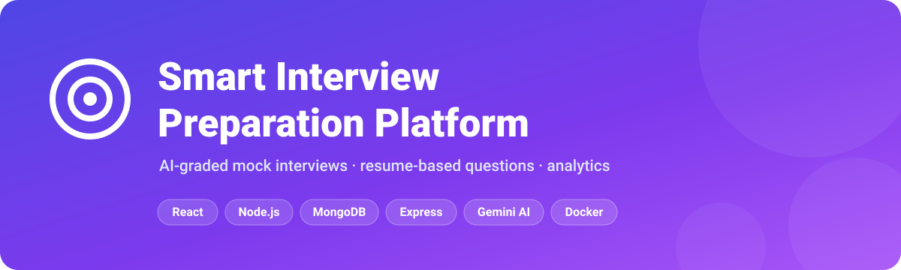
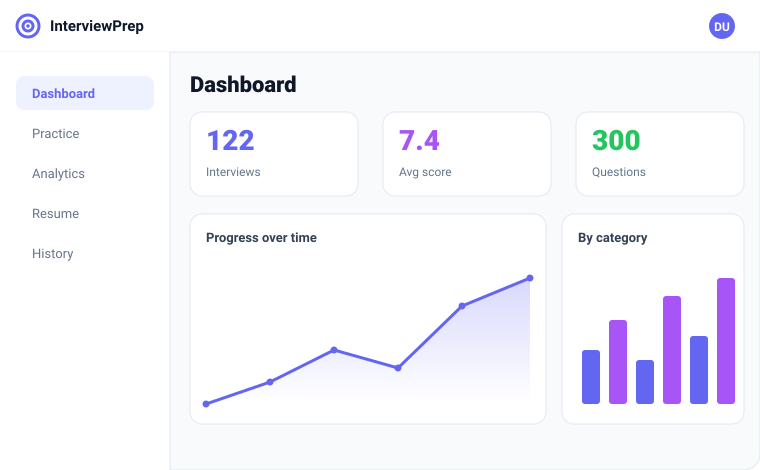
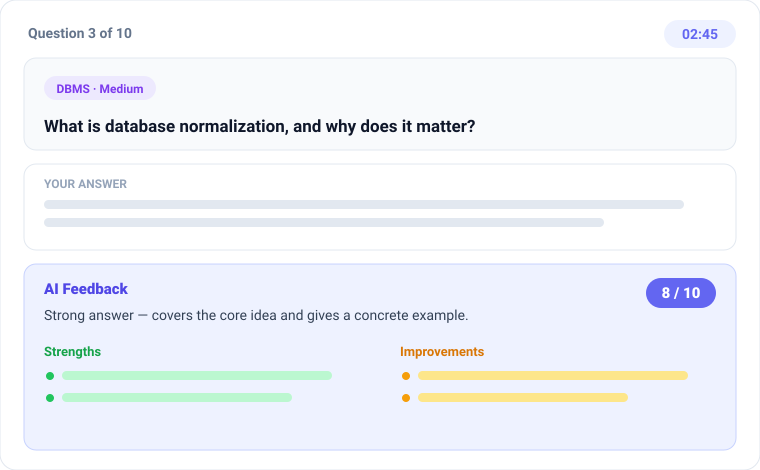
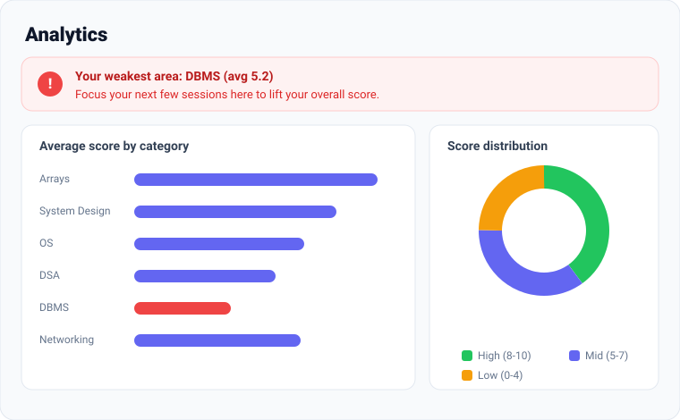

<p align="center">
  <a href="https://smart-interview-preparation-platfor-theta.vercel.app">
    
  </a>
  <a href="LICENSE">
    
  </a>
  
</p>

<p align="center">
  <a href="https://github.com/tushar4935/Smart-Interview-Preparation-Platform/actions/workflows/ci.yml">
    
  </a>
</p>

A full-stack **MERN** app for practicing technical and behavioral interviews, with answers graded by **AI (Google Gemini)** instead of crude keyword matching. It generates questions from your resume, tracks your weak areas over time, and supports coding questions in an embedded editor.

> **🚀 Live demo:** https://smart-interview-preparation-platfor-theta.vercel.app
>
> The backend runs on a free tier, so the very first request after it's been idle can take ~30s to wake up — after that it's instant.

**Demo logins**

| Role | Email | Password |
|------|-------|----------|
| User | `demo@example.com` | `demo123` |
| Admin | `admin@example.com` | `admin123` |

---

## Table of contents

- [Why I built this](#why-i-built-this)
- [What it does](#what-it-does)
- [A look inside](#a-look-inside)
- [Tech stack](#tech-stack)
- [Architecture](#architecture)
- [Running locally](#running-locally)
- [Environment variables](#environment-variables)
- [API reference](#api-reference)
- [Testing](#testing)
- [Deployment](#deployment)
- [Roadmap](#roadmap)
- [License](#license)

## Why I built this

Most interview-prep sites either just show you questions or "grade" your answer by checking whether it contains a few expected words. That falls apart fast: you can stuff an answer with buzzwords and score full marks, or explain something perfectly in your own words and score zero.

I wanted a tool that reads an answer the way an interviewer would — for **meaning** — and then tells you *why* it was good or weak and what to fix. So the core of the app sends each answer to an LLM (Google Gemini) and gets back a score, a verdict, and concrete strengths/improvements. To keep it from ever breaking when the AI is slow, over quota, or unconfigured, every AI call sits behind a keyword-matching fallback — so the app is always usable, and every answer records which path graded it.

Around that core I built the things that make practice actually stick: questions generated from your own resume, weak-area analytics over time, an embedded code editor for coding rounds, and a seeded database so the dashboards look alive from the very first login.

## What it does

- 🤖 **AI answer scoring** — Gemini grades each answer by *meaning*, returning a score out of 10, a verdict, specific feedback, and lists of strengths and improvements. Buzzword-stuffing gets caught; a correct answer in different words still scores well.
- 🛟 **Keyword fallback** — if Gemini is down, over quota, or no API key is set, scoring falls back to the original keyword matcher so the app never breaks. Every answer records which path graded it.
- 📄 **Practice from your resume** — upload a PDF, the server extracts the text (pdf-parse), Gemini pulls out your skills, and it builds a question set tailored to them.
- 💻 **Coding questions** — code answers get a Monaco editor with language selection and the same per-question timer.
- 🔁 **Follow-up questions** — after an answer, the AI can ask one context-aware follow-up based on what you said.
- 📊 **Analytics** — weak-area detection ("your lowest category is DBMS"), category and difficulty breakdowns, a progress-over-time line, score distribution, and the improvement notes that come up most.
- 🧾 **Downloadable PDF report** — export any completed interview as a PDF (client-side, via jsPDF).
- 🎤 **Voice answers** — dictate text answers using the browser's Web Speech API.
- 🔐 **Accounts** — JWT auth, email verification, and token-based password reset (links print to the server console in dev, or send over SMTP if configured).
- 🛠️ **Admin panel** — manage users and the question bank.
- 🌱 **300+ seeded questions** across 20 categories, plus sample users and ~120 completed interviews so the dashboards look alive from the first run.

## A look inside

> Stylized previews of the main screens — open the [live demo](https://smart-interview-preparation-platfor-theta.vercel.app) for the real thing.

| Dashboard | Interview session with AI feedback |
|-----------|------------------------------------|
|  |  |

| Weak-area analytics |
|---------------------|
|  |

## Tech stack

**Frontend:** React 18, Vite, Tailwind CSS, React Router, Recharts, Monaco Editor, jsPDF, Axios
**Backend:** Node.js, Express, MongoDB/Mongoose, JWT, Multer, Winston, Swagger
**AI:** Google Gemini (`gemini-2.0-flash`) via `@google/generative-ai`
**Testing/CI:** Jest, Supertest, mongodb-memory-server, ESLint, GitHub Actions
**Infra:** Docker + docker-compose, MongoDB Atlas, Render/Railway, Vercel

## Architecture

```
┌──────────────┐      HTTPS / JSON      ┌───────────────────┐      ┌────────────┐
│  React (Vite)│ ────────────────────▶  │  Express API      │ ───▶ │  MongoDB   │
│  Tailwind    │  ◀────────────────────  │  JWT · Mongoose   │      │  (Atlas)   │
│  Recharts    │      Bearer token       │  Winston · Swagger│      └────────────┘
└──────────────┘                         └────────┬──────────┘
       │                                          │
       │ jsPDF, Monaco, Web Speech                │ @google/generative-ai
       ▼                                          ▼
   runs in browser                         ┌──────────────┐
                                           │  Gemini API  │
                                           │  scoring,    │
                                           │  skills, Qs  │
                                           └──────┬───────┘
                                                  │ on failure / no key
                                                  ▼
                                          keyword fallback scorer
```

The frontend is a static SPA that talks to the API over `/api`. The API is stateless (JWT in the `Authorization` header), so it scales horizontally. All Gemini calls live behind `services/aiService.js`, which wraps them with a timeout and a keyword fallback so a flaky or missing AI never takes the app down. In dev, Vite proxies `/api` to the backend; in production the SPA points at the deployed API via `VITE_API_URL`.

## Running locally

### Option A — Docker (one command)

```bash
# optional: export GEMINI_API_KEY=your_key   (leave unset to use keyword scoring)
docker compose up --build
docker compose exec backend npm run seed   # first run only
```

- App: http://localhost:8080
- API: http://localhost:5000/api
- API docs: http://localhost:5000/api-docs

### Option B — manual

Requires Node 18+ and a local MongoDB (or an Atlas URI).

```bash
# backend
cd backend
cp .env.example .env          # then fill in the values
npm install
npm run seed                  # 300+ questions + sample data
npm run dev                   # http://localhost:5000

# frontend (new terminal)
cd frontend
npm install
npm run dev                   # http://localhost:5173
```

Get a free Gemini key at https://aistudio.google.com/app/apikey and put it in `backend/.env` as `GEMINI_API_KEY`. Without it, the app runs fine on keyword scoring.

## Environment variables

**Backend** (`backend/.env`)

| Variable | Purpose |
|----------|---------|
| `MONGODB_URI` | MongoDB connection string |
| `JWT_SECRET` | Secret for signing tokens |
| `JWT_EXPIRE` | Token lifetime (e.g. `30d`) |
| `CLIENT_URL` | Allowed CORS origin(s), comma-separated |
| `GEMINI_API_KEY` | Gemini key — blank falls back to keyword scoring |
| `LOG_LEVEL` | Winston level (`debug`/`info`) |
| `SMTP_HOST` / `SMTP_PORT` / `SMTP_USER` / `SMTP_PASS` | Optional email transport; without it, links log to console |

**Frontend** (`frontend/.env`)

| Variable | Purpose |
|----------|---------|
| `VITE_API_URL` | Base URL of the deployed backend (omit in dev to use the Vite proxy) |

## API reference

Full interactive docs (Swagger UI) are served at **`/api-docs`**. Highlights:

| Method | Endpoint | Description |
|--------|----------|-------------|
| `POST` | `/api/auth/register` | Create account (returns JWT) |
| `POST` | `/api/auth/login` | Log in |
| `POST` | `/api/auth/forgot-password` | Request reset link |
| `POST` | `/api/auth/reset-password` | Reset with token |
| `POST` | `/api/interviews/start` | Start a standard interview |
| `POST` | `/api/interviews/from-resume` | Generate an interview from a resume (AI) |
| `PUT` | `/api/interviews/:id/answer` | Submit + score an answer |
| `PUT` | `/api/interviews/:id/complete` | Finish an interview |
| `GET` | `/api/resumes/:id/analyze` | Extract skills from a resume (AI) |
| `GET` | `/api/dashboard` | Summary stats + chart data |
| `GET` | `/api/dashboard/analytics` | Weak areas + breakdowns |

## Testing

```bash
cd backend
npm test              # Jest + Supertest (auth, AI scoring with mocked Gemini, interview flow)
npm run test:coverage
```

Tests use an in-memory MongoDB (or a `MONGO_TEST_URI` if provided), so they don't need a running database. Gemini is mocked, and the fallback path is covered too. GitHub Actions runs lint + tests on the backend and lint + build on the frontend for every push and PR.

## Deployment

The live demo runs on **MongoDB Atlas + Render (backend) + Vercel (frontend)**.

- **Database:** create a free MongoDB Atlas M0 cluster, then seed it (`MONGODB_URI=<atlas-uri> npm run seed`).
- **Backend:** deploy `backend/` to Render or Railway (the included `backend/Dockerfile` handles build + run). Set `MONGODB_URI`, `JWT_SECRET`, `GEMINI_API_KEY`, `CLIENT_URL` (your Vercel URL), and any SMTP vars.
- **Frontend:** deploy `frontend/` to Vercel. Set `VITE_API_URL` to the backend URL (no trailing `/api`). Add the Vercel domain to the backend's `CLIENT_URL`.

## Roadmap

- [ ] Enable live Gemini scoring on the hosted demo (a valid key with quota — the code already supports it, no changes needed)
- [ ] Real captured screenshots + a short demo GIF of a full interview
- [ ] More question categories and company-specific question sets
- [ ] Shareable interview report links

## License

MIT — see [LICENSE](LICENSE).
